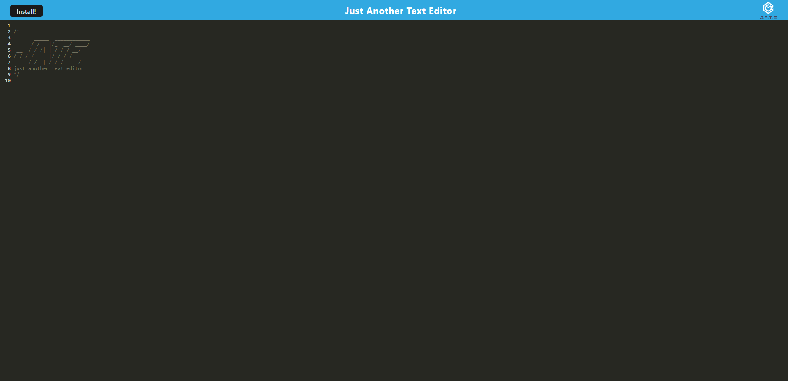
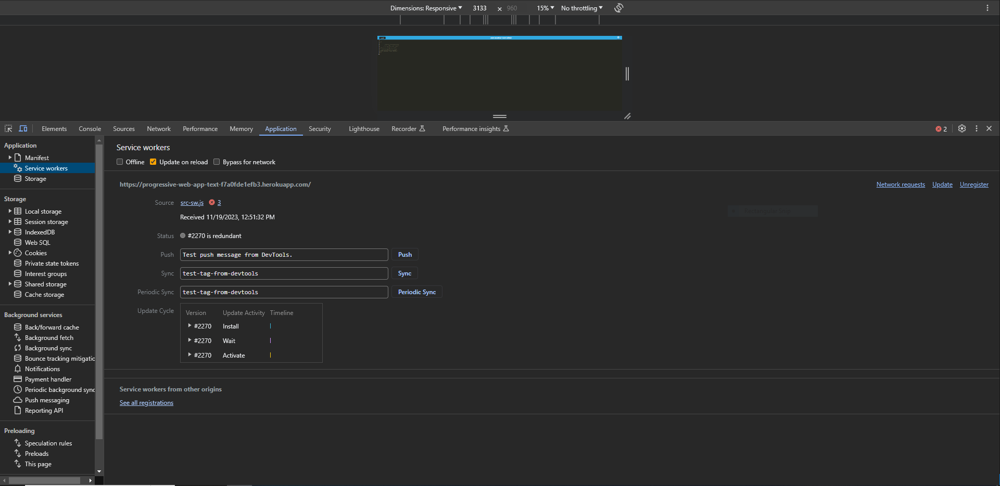
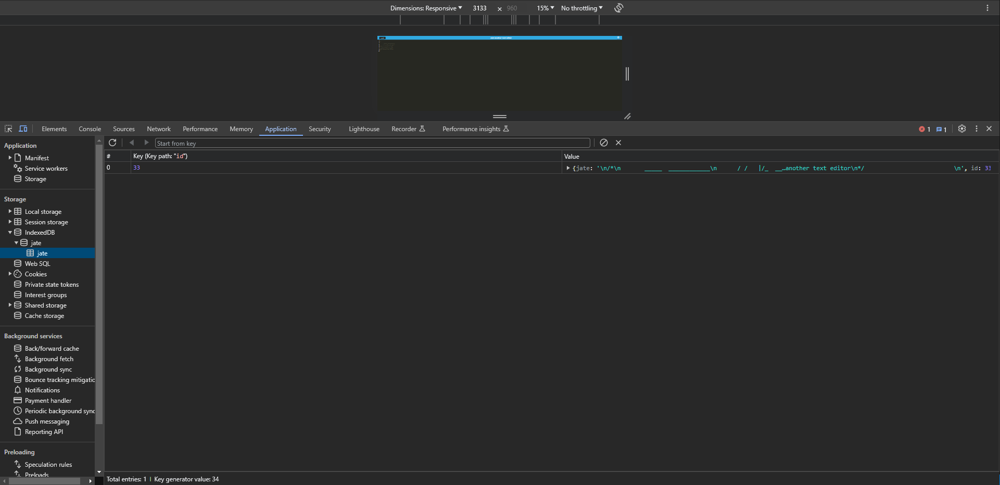

# Progressive-Web-Application-Text-Editor

## Description
This PWA Text Editor will allow users to create notes or code snippets and run the application from their browser. This application will also be able to run offline.

## Table of Contents
* [Usage](#usage)
* [Application](#application)
* [Contact-Me](#contact)
* [Contributors](#contributors)
* [Testing](#testing)
* [License](#license)

## Usage
Clone the repository then run "npm run start" in the terminal. The application should open up in your browser. Enjoy!

## Mock-Up

The following image demonstrates the application functionality:

The following image shows the application's `manifest.json` file:

The following image shows the application's registered service worker:

The following image shows the application's IndexedDB storage:

## Application

Please click on the [link](https://progressive-web-app-text-f7a0fde1efb3.herokuapp.com/) to visit the PWA Text Editor application. 

## Contact
* Name - Ricardo Scuotto
* Email - ucfscuotto@gmail.com
* Github - [Ricky-Sama](https://github.com/Ricky-Sama/)
## Contributors
N/A
## Testing
N/A
## License

    Licensed under the MIT license